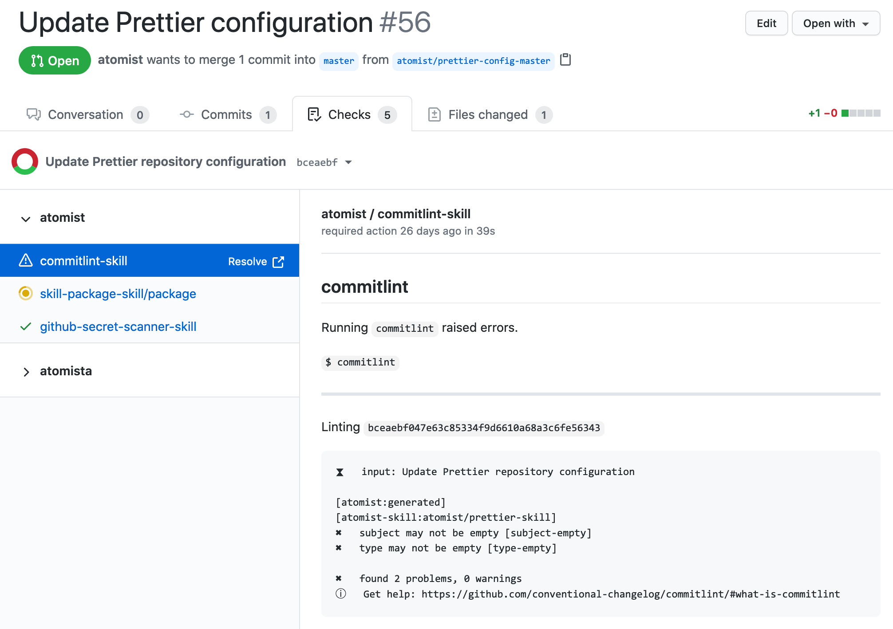

Use [commitlint][] to adhere to a commit message convention by monitoring
commits on incoming pull requests across all of your repositories.

-   Apply the same commit conventions across all repositories without manual
    configuration
-   commitlint output reported as pull request check
-   Enjoy the benefits of consistent, informative, and clear commit messages

[commitlint]: https://commitlint.js.org/ "commitlint - Lint Commit Messages"

### Pull request commit check

