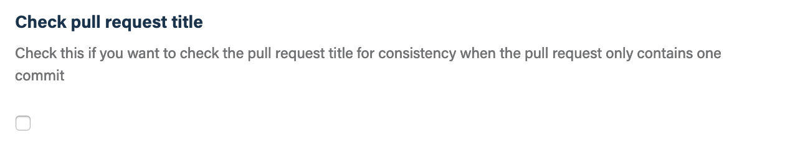
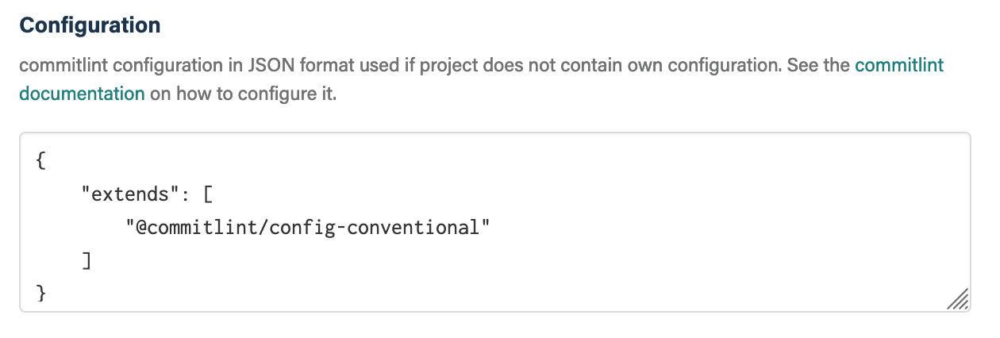
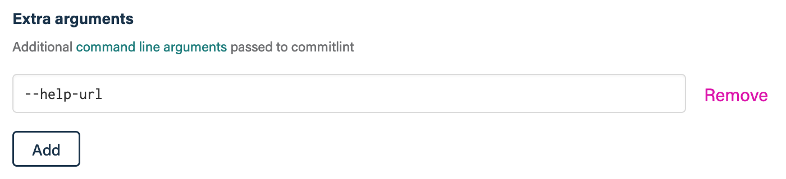
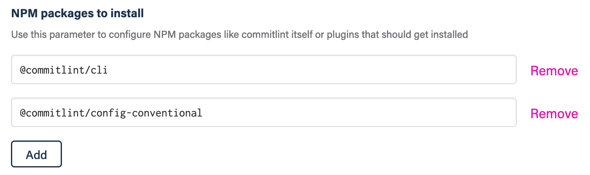

## Before you get started

Connect and configure these integrations:

1.  [**GitHub**](https://go.atomist.com/catalog/integration/github "GitHub Integration")
    _(required)_

## How to configure

1.  **Lint all commits or just the HEAD commit**

    

    By default, the messages of all commits in a pull request are linted. To
    only lint the message of the HEAD commit, check this box.

1.  **Lint pull request title**

    

    To also lint the title of the pull request, check this box.

1.  **commitlint configuration**

    

    Provide the
    [commitlint configuration](https://commitlint.js.org/#/reference-configuration)
    in JSON format to be used for linting pull request commit messages.

1.  **commitlint command-line options**

    

    Provide additional command-line options to pass to the `commitlint` command.
    See the
    [commitlint documentation](https://commitlint.js.org/#/reference-cli) for a
    list of available arguments.

1.  **Packages and plugins to be installed**

    

    If your commitlint configuration needs special packages or plugins, use this
    parameter to specify the NPM packages that should be installed in addition
    to dependencies from the `package.json`.

1.  **Determine repository scope**

    

    By default, this skill will be enabled for all repositories in all
    organizations you have connected.

    To restrict the organizations or specific repositories on which the skill
    will run, you can explicitly choose organizations and repositories.

1.  **Activate the skill**

    Save your configuration and activate the skill by clicking the "Enable
    skill" button.
